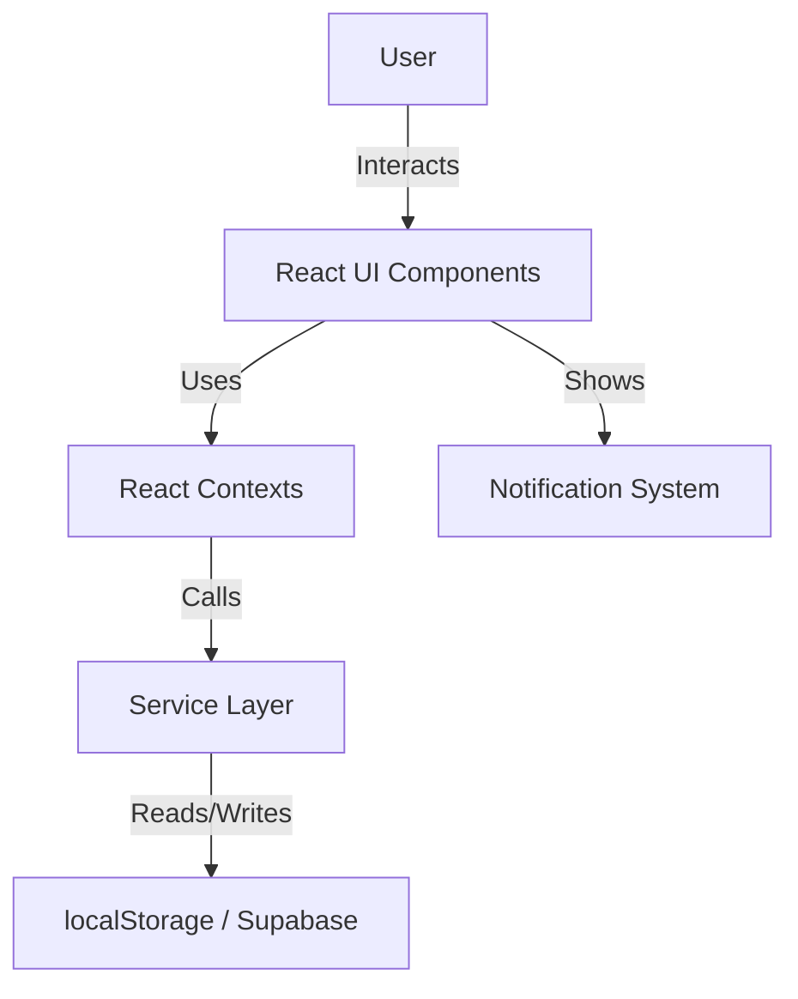

# System Architecture Overview

Welcome to ClassFlow! This document provides a high-level overview of the system for new developers and maintainers.

## Philosophy

- **MVP First:** Build for clarity and maintainability, then scale. See `Remember_when_Coding.md` for the full roadmap.
- **Feature Modularity:** Each major feature (auth, scheduling, components) is isolated for testability and future backend migration.
- **Type Safety:** TypeScript is enforced everywhere.

## Main Flows



- **UI Components:** Present data, handle user input, and show notifications.
- **Contexts:** Provide state and CRUD methods for features (auth, sessions, timetable, etc.).
- **Hooks:** Custom hooks (e.g., `useClassSessions`) access context and encapsulate logic.
- **Services:** Abstract data access (localStorage for now, ready for Supabase backend).
- **Notification:** All user-facing errors and important events use the notification system.

## Folder Structure

```txt
src/
  features/
    auth/                # Authentication (API, context, pages, routes)
    scheduleLessons/     # Class/session/timetable management
      contexts/          # Context providers for state
      hooks/             # Custom hooks
      pages/             # Page-level components
      components/        # UI and feature components
      services/          # Data access (localStorage, ready for backend)
      types/             # TypeScript types
      utils/             # Pure business logic (e.g., timetableLogic)
```

## Data Flow Example

1. **User** interacts with a form (e.g., create class session).
2. **Component** calls a context method (e.g., `addClassSession`).
3. **Context** delegates to a service (e.g., `classSessionsService`).
4. **Service** updates localStorage (or Supabase in the future).
5. **Context** updates state, UI re-renders.
6. **Errors** are shown via the notification system.

## Extending & Scaling

- To add a new feature, create a new folder in `features/` and follow the modular pattern.
- To migrate to a backend, update the service layer to use API calls instead of localStorage.
- For more, see `Remember_when_Coding.md`.
