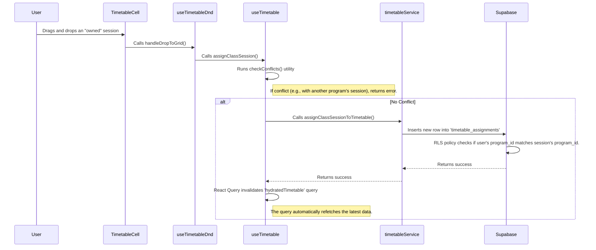

# System Architecture

This document provides a deep dive into the system architecture of ClassFlow. It explains the core design principles, the multi-user data model, folder structure, data flow, and key technologies used to enable a simultaneous, role-based scheduling workflow.

## Core Principles

- **Modularity (Feature-Sliced Design)**: The codebase is organized by features (e.g., `auth`, `classSessions`, `timetabling`). Each feature is a self-contained unit with its own UI, state, logic, and services. This makes the codebase easier to navigate, maintain, and test.
- **Clear Separation of Concerns**: Within each feature, a strict separation is maintained between different layers:
  - **UI Components (`pages`, `components`)**: Responsible only for rendering and capturing user events.
  - **State Management (`hooks`)**: Custom hooks encapsulate all logic for fetching, caching, and mutating data.
  - **Data Access (`services`)**: The service layer is the only part of the application that communicates directly with the backend (Supabase).
- **Server State Authority**: We use **TanStack Query (React Query)** as the authority for server state. This eliminates the need for complex client-side state management for data that lives in the database.
- **Type Safety**: TypeScript is used throughout the project. Types for the Supabase schema are auto-generated to ensure end-to-end type safety.

## Technology Stack

- **Framework**: [Vite](https://vitejs.dev/) + [React](https://reactjs.org/)
- **Language**: [TypeScript](https://www.typescriptlang.org/)
- **Backend**: [Supabase](https://supabase.com/)
- **State Management**: [TanStack Query (React Query)](https://tanstack.com/query/latest)
- **Styling**: [Tailwind CSS](https://tailwindcss.com/)
- **Routing**: [React Router](https://reactrouter.com/)
- **Testing**: [Vitest](https://vitest.dev/)

## Folder Structure

The `src` directory is organized using a feature-based approach:

```txt
src/
├── components/         # 1. Global UI Components
│   ├── layout/         # -- App Shell / Layout (AppLayout, tests)
│   ├── ui/             # -- Reusable UI Primitives (ActionButton, FormField)
│   ├── Header.tsx      # -- Moved from features
│   └── Sidebar.tsx     # -- Moved from features
├── features/           # 2. Application Features
│   ├── auth/           # -- Authentication Feature
│   └── timetabling/    # -- Timetabling Feature
├── lib/                # 3. Core Libraries & Singletons
└── routes/             # 4. Route Configuration
```

1. **`/components`**: Contains global, reusable components. `layout/` holds the main application shell, while `ui/` holds primitive components.
2. **`/features/*`**: The heart of the application. Each folder is a feature domain.
3. **`/lib`**: Holds setup code for external libraries and core application services.
4. **`/routes`**: Defines the application's URL structure and routing logic.

## Multi-User Data Model & Security

The architecture is built on a multi-user model centered around **Programs** and **Roles**.

### 1. Database Schema

- **`programs` Table**: A central table that defines each academic program (e.g., "Computer Science").
- **`profiles` Table**: Extends Supabase's `auth.users` to include a `role` (`admin` or `program_head`) and a foreign key to `programs` (`program_id`). This links each user to their specific role and program.
- **`class_sessions` Table**: Includes a `program_id` to establish clear ownership of each class session by a program.

### 2. Row Level Security (RLS)

Permissions are enforced at the database level using Supabase RLS policies.

- **Admin-Only Writes**: Only users with the `admin` role can modify system-wide settings like `schedule_configuration`. All other users have read-only access.
- **Program-Scoped Writes**: Program Heads can only create, update, or delete `timetable_assignments` for class sessions that belong to their own `program_id`. All users have read access to see the complete, school-wide schedule.

## Data Flow Example: Assigning a Session

This flow demonstrates how the different layers interact in a multi-user context.



### Real-time Updates

The `useTimetable` hook subscribes to all changes in the `timetable_assignments` table.

1. A user from **Program A** moves a session.
2. Supabase sends a real-time event to all subscribed clients, including a user from **Program B**.
3. The hook in Program B's client receives the event and invalidates its React Query cache.
4. React Query refetches the timetable data, and the UI for Program B's user updates instantly to show the new placement of Program A's session.
