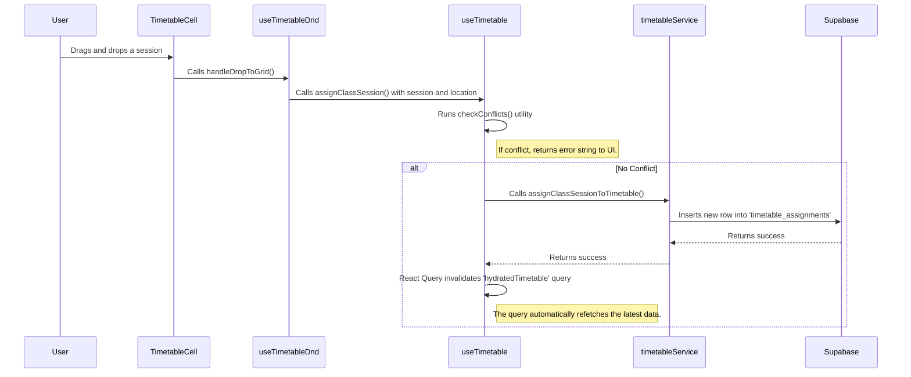

# Architecture Overview

This document provides a deep dive into the system architecture of ClassFlow. It explains the core design principles, folder structure, data flow, and key technologies used.

## Core Principles

- **Modularity (Feature-Sliced Design)**: The codebase is organized by features (e.g., `auth`, `classSessions`, `timetabling`). Each feature is a self-contained unit with its own UI, state, logic, and services. This makes the codebase easier to navigate, maintain, and test.
- **Clear Separation of Concerns**: Within each feature, a strict separation is maintained between different layers:
  - **UI Components (`pages`, `components`)**: Responsible only for rendering and capturing user events. They are kept as "dumb" as possible.
  - **State Management (`hooks`)**: Custom hooks encapsulate all logic for fetching, caching, and mutating data. UI components consume these hooks to get state and action handlers.
  - **Data Access (`services`)**: The service layer is the only part of the application that communicates directly with the backend (Supabase). It abstracts all data-fetching logic.
- **Server State Authority**: We use **TanStack Query (React Query)** as the authority for server state. This eliminates the need for complex client-side state management for data that lives in the database. React Query handles caching, background refetching, and optimistic updates, leading to a simpler, more robust application.
- **Type Safety**: TypeScript is used throughout the project. Types for the Supabase schema are auto-generated to ensure end-to-end type safety between the database and the frontend.

## Technology Stack

- **Framework**: [Vite](https://vitejs.dev/) + [React](https://reactjs.org/)
- **Language**: [TypeScript](https://www.typescriptlang.org/)
- **Backend**: [Supabase](https://supabase.com/)
  - **Database**: Supabase Postgres
  - **Authentication**: Supabase Auth
  - **Real-time**: Supabase Realtime Subscriptions
- **State Management**: [TanStack Query (React Query)](https://tanstack.com/query/latest)
- **Styling**: [Tailwind CSS](https://tailwindcss.com/)
- **Routing**: [React Router](https://reactrouter.com/)
- **Testing**: [Vitest](https://vitest.dev/)

## Folder Structure

The `src` directory is organized using a feature-based approach:

```txt
src/
├── components/         # 1. Global, Reusable UI Components (e.g., ActionButton, FormField)
│   └── ui/
├── features/           # 2. Application Features
│   ├── auth/           # -- Authentication Feature
│   │   ├── components/
│   │   ├── contexts/   # (AuthProvider for session state)
│   │   ├── hooks/      # (useAuth hook)
│   │   ├── pages/
│   │   └── services/   # (authService.ts)
│   │
│   ├── classSessions/  # -- Class Session Management Feature
│   │   ├── hooks/      # (useClassSessions hook)
│   │   ├── pages/
│   │   └── services/   # (classSessionsService.ts)
│   │
│   └── timetabling/    # -- Timetabling Feature
│       ├── hooks/        # (useTimetable, useTimetableDnd)
│       ├── pages/
│       │   ├── components/ # (Drawer, Header, Sidebar)
│       │   │   └── timetable/  # (New Modular Timetable Components)
│       │   │       ├── EmptyCell.tsx
│       │   │       ├── index.tsx
│       │   │       ├── SessionCell.tsx
│       │   │       ├── TimetableContext.tsx
│       │   │       └── ...
│       │   └── TimetablePage.tsx
│       ├── services/     # (timetableService.ts)
│       └── utils/        # (checkConflicts.ts - Pure business logic)
│
├── lib/                # 3. Core Libraries & Singletons
│   ├── supabase.ts     # (Supabase client instance)
│   └── notificationsService.ts # (Global notification system)
│
└── routes/             # 4. Route Configuration
```

1. **`/components/ui`**: Contains highly generic, application-agnostic UI components that could be used in any project.
2. **`/features/*`**: The heart of the application. Each folder is a feature domain.
3. **`/lib`**: Holds setup code for external libraries and core application services.
4. **`/routes`**: Defines the application's URL structure and routing logic.

## Data Flow: An Example (Assigning a Session)

This flow demonstrates how the different layers interact, powered by React Query.



### Real-time Updates

The `useTimetable` hook also subscribes to changes in the `timetable_assignments` table in Supabase.

1. Another user makes a change, which updates a row in the database.
2. Supabase sends a real-time event to all subscribed clients.
3. The `useEffect` in `useTimetable` receives the event.
4. It calls `queryClient.invalidateQueries({ queryKey })`.
5. React Query automatically refetches the data, ensuring the UI is always up-to-date without needing manual state management.

This architecture creates a responsive, maintainable, and scalable application. To add a new data entity, a developer simply creates a new feature folder with its own service and hook, following the established pattern.

### Timetable Component Architecture

The `Timetable` feature is a prime example of our architectural principles in action. Previously a single monolithic component, it has been refactored into a modular structure to manage its complex state and avoid prop drilling.

- **Component Decomposition**: The main grid is broken down into smaller, focused components like `TimetableRow`, `SessionCell`, and `EmptyCell`.
- **State Management with Context**: A `TimetableContext` is used to provide drag-and-drop state (e.g., the currently dragged item, the cell being hovered over) and event handlers directly to the components that need them. This eliminates the need to pass numerous props through the component tree.
- **Real-time Feedback**: This structure allows child components like `EmptyCell` to access the currently dragged session from the context, call the `checkConflicts` utility, and render appropriate visual feedback (a red or green highlight) in real-time, creating a highly interactive user experience.
