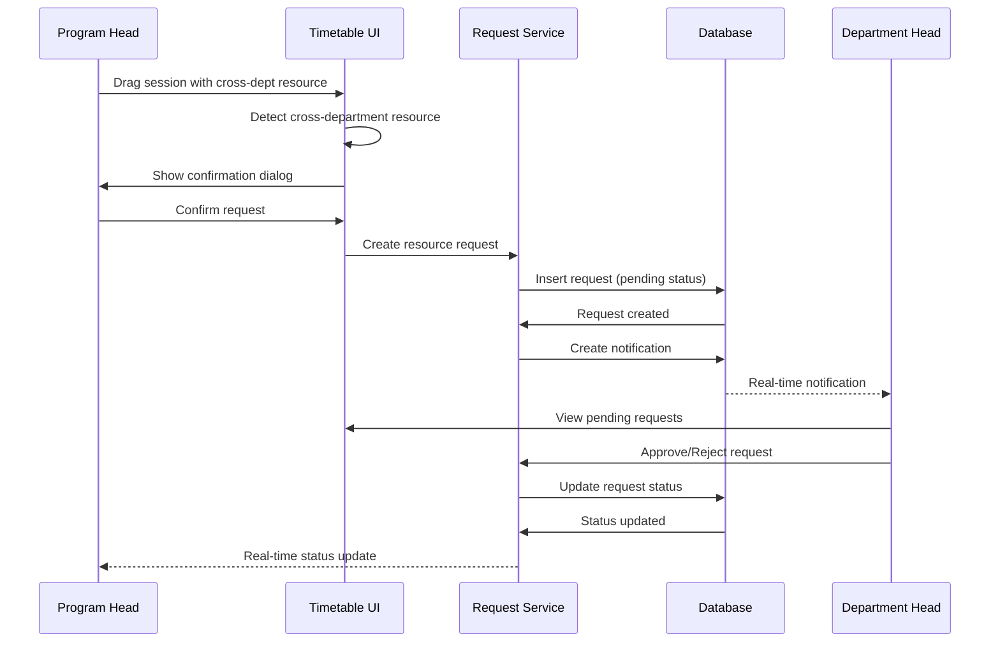

# Cross-Department Resource Request Workflow - October 2025

## Overview

Implementation of a complete cross-department resource request and approval workflow, enabling program heads to request instructors and classrooms from other departments with proper approval mechanisms.

**Completed**: October 2025  
**Type**: Feature  
**Impact**: Major - Enables cross-department collaboration

---

## Problem Statement

Previously, program heads could only use resources (instructors and classrooms) from their own department. There was no mechanism to:
1. Request resources from other departments
2. Track pending requests
3. Allow department heads to approve/reject requests
4. Restore sessions when requests are rejected
5. Prevent unauthorized cross-department assignments

---

## Solution

### Architecture



### Key Components

1. **Detection System**
   - Identify cross-department instructors/classrooms during drag operations
   - Check resource department against session program department

2. **Request Creation**
   - Create `resource_requests` record with pending status
   - Store original placement for rollback on rejection
   - Create notification for target department head

3. **Approval Workflow**
   - Department heads see pending requests in notification panel
   - Approve: Confirm assignment and mark request as approved
   - Reject: Restore session to original position, provide feedback

4. **Status Tracking**
   - Visual indicators on timetable (pending vs. confirmed)
   - Real-time updates via Supabase subscriptions
   - Notification counts and filtering

---

## Implementation Details

### Database Changes

#### New Table: `resource_requests`
```sql
CREATE TABLE resource_requests (
  id UUID PRIMARY KEY DEFAULT gen_random_uuid(),
  class_session_id UUID NOT NULL REFERENCES class_sessions(id),
  resource_id UUID NOT NULL,
  resource_type TEXT NOT NULL CHECK (resource_type IN ('instructor', 'classroom')),
  requesting_program_id UUID NOT NULL REFERENCES programs(id),
  target_department_id UUID NOT NULL REFERENCES departments(id),
  requester_id UUID NOT NULL,
  reviewed_by UUID,
  status TEXT NOT NULL DEFAULT 'pending' CHECK (status IN ('pending', 'approved', 'rejected', 'cancelled')),
  rejection_message TEXT,
  notes TEXT,
  original_period_index INT,
  original_class_group_id UUID,
  requested_at TIMESTAMPTZ DEFAULT NOW(),
  reviewed_at TIMESTAMPTZ,
  dismissed BOOLEAN DEFAULT FALSE
);
```

#### New Table: `request_notifications`
```sql
CREATE TABLE request_notifications (
  id UUID PRIMARY KEY DEFAULT gen_random_uuid(),
  request_id UUID NOT NULL REFERENCES resource_requests(id),
  target_department_id UUID NOT NULL REFERENCES departments(id),
  message TEXT NOT NULL,
  read_at TIMESTAMPTZ,
  created_at TIMESTAMPTZ DEFAULT NOW()
);
```

### Database Functions

#### `handle_cross_dept_session_move()`
Handles the complete cross-department request workflow:
- Creates resource request record
- Creates notification for department head
- Returns request details for UI feedback

**Parameters**:
- `_class_session_id` - Session being moved
- `_new_class_group_id` - Target class group
- `_new_period_index` - Target time slot
- `_old_class_group_id` - Original class group (for rollback)
- `_old_period_index` - Original time slot (for rollback)
- `_semester_id` - Current semester

**Returns**: JSON with request details

#### `approve_resource_request()`
Approves a pending request:
- Updates request status to 'approved'
- Sets reviewed_by and reviewed_at
- Returns updated request

**Parameters**:
- `_request_id` - Request to approve
- `_reviewer_id` - Department head user ID

**Returns**: JSON with request details

#### `reject_resource_request()`
Rejects a request and restores session:
- Updates request status to 'rejected'
- Restores session to original placement
- Stores rejection message
- Returns restoration details

**Parameters**:
- `_request_id` - Request to reject
- `_reviewer_id` - Department head user ID
- `_rejection_message` - Feedback for program head

**Returns**: JSON with restoration details

#### `cancel_resource_request()`
Allows program head to cancel their own request:
- Updates request status to 'cancelled'
- Restores session to original placement
- Returns restoration details

**Parameters**:
- `_request_id` - Request to cancel
- `_requester_id` - Program head user ID

**Returns**: JSON with restoration details

### Services

**`resourceRequestService.ts`** in `lib/services/`:
- `createResourceRequest()` - Create new request
- `approveRequest()` - Approve pending request
- `rejectRequest()` - Reject request with message
- `cancelRequest()` - Cancel own request
- `dismissRequest()` - Mark request as reviewed
- `getRequestsByDepartment()` - Fetch department requests
- `getRequestsByProgram()` - Fetch program requests
- `cancelActiveRequestsForResource()` - Cancel all requests for a resource

### UI Components

#### Confirmation Dialogs
- `ConfirmDialog.tsx` - Generic confirmation with variants
- `RejectionDialog.tsx` - Rejection with required message input

#### Notification Systems
- `RequestNotifications.tsx` - Department head notification panel
- `PendingRequestsPanel.tsx` - Program head pending requests

#### Timetable Enhancements
- Visual indicators for pending vs. confirmed sessions
- Confirmation dialogs for cross-department moves
- Status badges and tooltips

---

## User Workflows

### Program Head: Request Cross-Department Resource

1. Create class session with instructor from another department
2. Drag session to timetable
3. System detects cross-department resource
4. Confirmation dialog appears:
   - Shows resource details
   - Explains approval required
   - Allows adding notes
5. Confirm request
6. Session placed with "pending" indicator
7. Track status in pending requests panel

### Department Head: Approve Request

1. Receive real-time notification
2. Open notification panel
3. Review request details:
   - Requesting program
   - Resource details
   - Session information
   - Any notes from requester
4. Click "Approve"
5. Request marked as approved
6. Program head sees confirmed status

### Department Head: Reject Request

1. Open notification panel
2. Review request details
3. Click "Reject"
4. Rejection dialog appears
5. Enter required rejection message
6. Confirm rejection
7. Session automatically restored to original position
8. Program head notified with message

### Program Head: Cancel Request

1. View pending requests panel
2. Find request to cancel
3. Click "Cancel"
4. Session automatically restored
5. Request marked as cancelled

---

## Files Modified

### Database
- `supabase/migrations/` - New tables and functions

### Services
- `src/lib/services/resourceRequestService.ts` - Complete request workflow
- `src/lib/services/timetableService.ts` - Integration with requests

### Features
- `src/features/program-head/request-cross-dept-resource/` - Request creation
- `src/features/program-head/view-pending-requests/` - Request tracking
- `src/features/department-head/approve-request/` - Approval workflow
- `src/features/department-head/reject-request/` - Rejection workflow
- `src/features/department-head/view-department-requests/` - Department requests

### Components
- `src/components/dialogs/ConfirmDialog.tsx` - Confirmation UI
- `src/components/dialogs/RejectionDialog.tsx` - Rejection UI
- `src/components/RequestNotifications.tsx` - Notification panel
- `src/components/PendingRequestsPanel.tsx` - Request tracking

### Hooks
- `src/features/resourceRequests/hooks/useResourceRequests.ts` - Request management
- `src/features/resourceRequests/hooks/useRequestNotifications.ts` - Notification handling

---

## Testing

### Unit Tests
- `resourceRequestService.test.ts` - Service layer operations
- `databaseFunctions.test.ts` - DB function validation

### Integration Tests
- `approvalWorkflow.integration.test.tsx` - Complete approval flow
- `rejectionWorkflow.integration.test.tsx` - Complete rejection flow
- `removeToDrawer.integration.test.tsx` - Cancellation and restoration

### E2E Tests
- `cypress/e2e/05-timetabling/cross-dept-confirmation.cy.ts` - Complete workflows

### Test Coverage
- ✅ Request creation and validation
- ✅ Approval workflow end-to-end
- ✅ Rejection with restoration
- ✅ Cancellation by requester
- ✅ Notification delivery
- ✅ Status updates and real-time sync
- ✅ Permission checks (RLS policies)

---

## Security Considerations

### Row Level Security (RLS)

**resource_requests table**:
- Program heads can create requests for their program
- Program heads can view their program's requests
- Department heads can view requests targeting their department
- Department heads can approve/reject their department's requests
- Admins have full access

**request_notifications table**:
- Department heads can view notifications for their department
- Admins have full access

### Validation
- Cross-department detection uses proper department lookups
- Resource ownership verified before request creation
- Approval/rejection limited to target department heads
- Cancellation limited to original requester

---

## Performance Considerations

### Optimizations
- Real-time subscriptions for instant updates
- Optimistic UI updates with rollback on errors
- Efficient queries with proper indexes
- Batch operations where possible

### Caching
- TanStack Query caching for request lists
- Automatic cache invalidation on status changes
- Stale-while-revalidate strategy

---

## Future Enhancements

### Potential Improvements
1. **Request History**: Track all status changes over time
2. **Bulk Operations**: Approve/reject multiple requests at once
3. **Request Templates**: Save common request patterns
4. **Email Notifications**: Notify users via email for important actions
5. **Request Analytics**: Track approval rates and response times
6. **Conditional Approval**: Allow partial approvals with conditions
7. **Request Scheduling**: Schedule automatic approvals based on rules

---

## Related Maintenance Logs

- `maintenance-log-2025-10-28-approval-fix.md` - Approval workflow fixes
- `maintenance-log-2025-10-29-rejection-workflow.md` - Rejection workflow implementation
- `maintenance-log-2025-10-29-request-workflow-complete.md` - Complete workflow summary

---

**Implemented By**: Development Team  
**Date**: October 2025  
**Status**: ✅ Complete and tested
