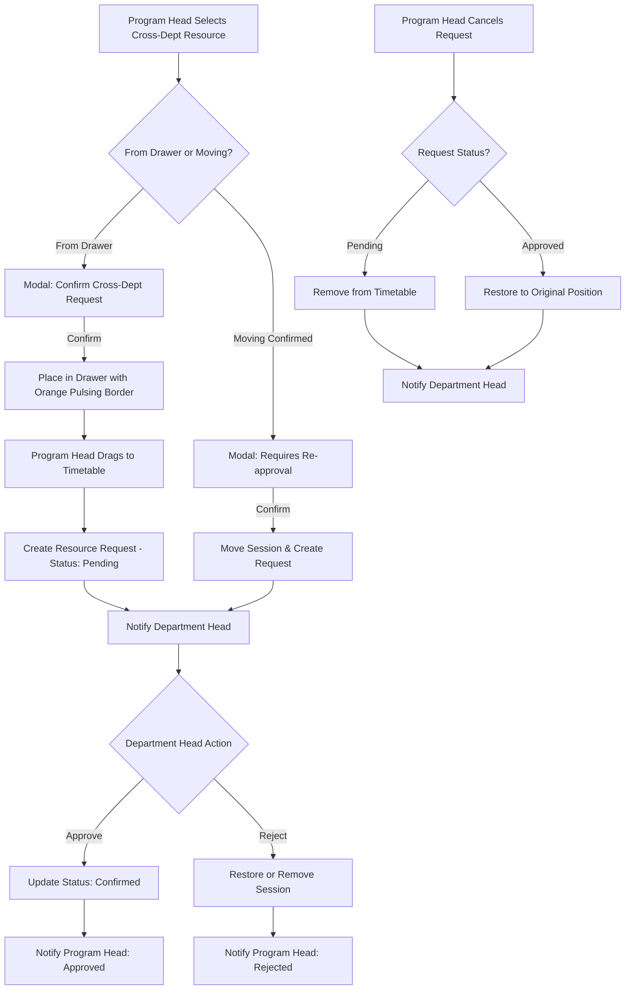

# Cross-Department Resource Request Approval System

## Overview

This feature enables program heads to request instructors or classrooms from other departments, requiring approval from the resource-owning department head before the assignment becomes confirmed. The system includes automatic notifications, confirmations, state management, and cancellation workflows for the entire request lifecycle.

---

## Architecture Flow

---

## Cancellation Workflow Details

### Entry Points

**1. From Pending Requests Panel (Notifications)**
- Program head clicks "Cancel" (X button) on their own pending request
- Triggers `useMyPendingRequests.cancelRequest` mutation
- Calls `cancelRequest(requestId, userId)` service function

**2. From Dragging to Drawer**
- Program head drags confirmed cross-dept session to drawer
- Triggers confirmation dialog: "This will cancel the approval"
- On confirm, calls `cancelActiveRequestsForClassSession(sessionId)`
- Only sends notifications, doesn't handle restoration (sessions dragged to drawer are removed)

### Behavior by Request Status

| Request Status | Action Taken | Assignment Status | Class Session | Department Head Notified |
|---------------|--------------|-------------------|---------------|-------------------------|
| **Pending** (initial placement) | Remove from timetable | Deleted | **Preserved** ✅ | Yes - "Request cancelled" |
| **Approved** (previously confirmed) | Restore to original position | Restored to original slot, status = 'confirmed' | **Preserved** ✅ | Yes - "Request cancelled" |

### Database Function: `cancel_resource_request`

**Purpose:** Atomically handle cancellation logic for program heads

**Parameters:**
- `_request_id` (uuid): The request to cancel
- `_requester_id` (uuid): User initiating cancellation (permission check)

**Logic:**
1. Validate request exists and requester has permission
2. Check request status is pending or approved
3. Get active semester
4. Create cancellation notification for department head
5. **If has original position (approved request):**
   - UPDATE timetable_assignments to restore original position
   - SET status = 'confirmed'
   - Return `{success: true, action: 'restored', ...}`
6. **Else (pending request):**
   - DELETE timetable_assignments for this session
   - Return `{success: true, action: 'removed_from_timetable', ...}`
7. DELETE resource_request

**Key Difference from Rejection:**
- Rejection is initiated by department heads (reviewers)
- Cancellation is initiated by program heads (requesters)
- Both preserve the class_session record ✅

---

## Test Coverage Summary

**Critical workflows are comprehensively tested at every system layer:**

- **Database (RPC functions & triggers):**
  - Approve, reject (including restoration and deletion), handle move, resource detection, notification cleanup
  - Error reporting, edge cases, RLS policy enforcement

- **Service Layer:**
  - Request creation, duplicate prevention, approval/rejection pathways, cancellation, detail enrichment

- **Hooks & Mutations:**
  - Request, assignment, and dismissal workflows
  - Pending, approval, rejection, move, and cancel resource flows

- **UI Integration/Component:**
  - Modals (confirmation, rejection): state/validation, feedback
  - Timetable grid/session cell: pending indicators, drag-n-drop, restrictions
  - Notification dropdowns for all user roles
  - Optimistic updates, error handling, context propagation

- **Permissions & Security:**
  - RLS/database policies for every action, including correct rejections
  - Admin, department, and program head role boundaries

- **Real-Time:**
  - Centralized RealtimeProvider channel subscriptions, patterned query invalidation (not refetching), edge-case event handling
  - Cleanup on component unmount, prevention of duplicate subscriptions, testable via stable wrapper

**Tests are written at the appropriate system boundary:**
- All business logic and workflow invariants are covered by the above tests, with frequent simulated Supabase failures to maintain error resilience under change.
- Hooks and UI use realistic mocks for all async and context dependencies.

**How to verify:**
- Run all tests via `npm run test`. All test suites must pass before merging any changes to this workflow.
- Additional exploratory tests or manual edge-case testing are advised when modifying RLS, RealtimeProvider strategies, or add/remove/cancel logic.

### UI Flow Testing - Same Department

- Create session with same-dept instructor → No modal
- Session assigned immediately as 'confirmed'
- Session appears normal (solid border, draggable)

### UI Flow Testing - Cross Department (Full Workflow)

**Initial Request:**

- [x] Program Head selects cross-dept resource → Modal appears
- [x] Modal shows department name and resource name
- [x] Program Head confirms → Redirected to timetable page
- [x] Session appears in drawer with pulsing orange border and badge
- [x] Toast notification guides user to drag session
- [x] Program Head drags session to timetable slot
- [x] Request created automatically after placement
- [x] Department head notified

**Pending Session Appearance (after placement):**

- Dashed orange border
- Reduced opacity (0.7)
- Clock icon indicator
- Non-draggable

**Department Head Approval:**

- [x] Notification appears in bell icon
- [x] Opens dropdown, sees enriched details
- [x] Clicks "See in Timetable" and navigates to cell in timetable
- [x] Clicks "Approve" → Loading state → Success toast
- [x] Request disappears from dropdown
- [x] Assignment status becomes 'confirmed'
- [x] Session updates to normal styling in real-time
- [x] Program head sees approval notification

**Department Head Rejection:**

- [x] Clicks "Reject" → Dialog opens requiring message
- [x] Cannot submit without message
- [x] Enters message, clicks "Reject Request"
- [x] If pending request: Session deleted from timetable
- [x] If approved request: Session restored to original position
- [x] Program head sees rejection notification with feedback message displayed

### UI Flow Testing - Session Movement

**Moving Confirmed Cross-Dept Sessions:**

- Drag confirmed cross-dept session to new slot
- Confirmation dialog appears: "This will require re-approval"
- Click "Cancel" → Session stays in place
- Click "Continue" → Session moves, status becomes 'pending'
- New request created with original position stored
- Department head notified

**Removing to Drawer:**

- Drag cross-dept session to drawer
- Confirmation dialog: "This will cancel the approval"
- Click "Cancel" → Session stays on timetable
- Click "Continue" → Session removed, requests cancelled
- Department head receives cancellation notification

### UI Flow Testing - Program Head Notifications

**Viewing Updates:**

- [x] After approval → Green badge on notifications bell
- [x] After rejection → Red badge on notifications bell
- [x] Click on item → See full details and rejection message in styled box
- [x] Click "Dismiss" → Item disappears immediately (optimistic update)
- [x] Refresh page → Dismissed items stay gone
- [x] Rejection message displayed with "Reason:" label in red-themed box

**Cancelling Requests:**

- [x] See pending requests in dropdown (separate Clock icon component)
- [x] Click "Cancel" (X button) → Request cancelled immediately
- [x] Confirm → Pending request: Session removed from timetable, class_session preserved
- [x] Confirm → Approved request: Session restored to original confirmed position, class_session preserved
- [x] All related queries invalidated for consistency
- [x] Department head receives cancellation notification

### Real-Time Testing

- Multiple users viewing same session
- Approval/rejection propagates instantly to all viewers
- Session styling updates without refresh
- Notification badges update in real-time